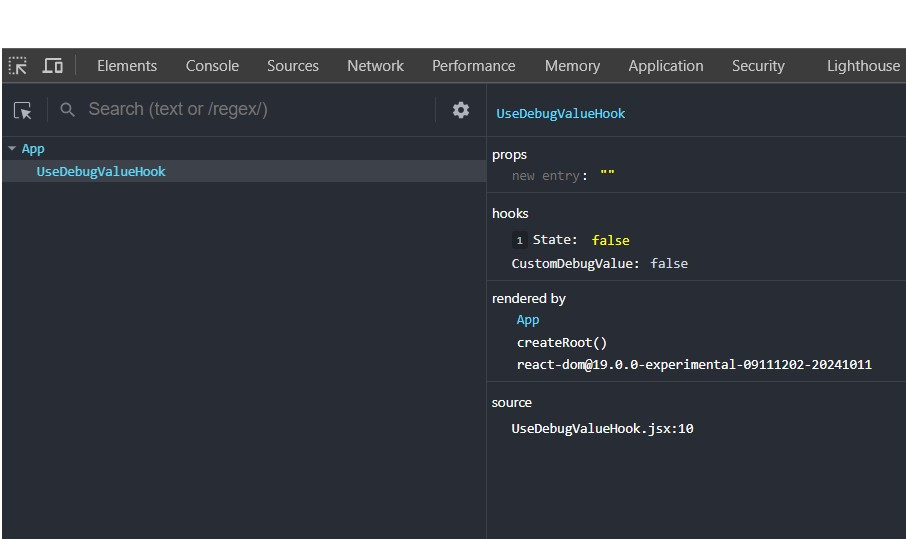

# Experimenting with `useDebugValue` in React

useDebugValue is the hook to debug the states by using react dev tools. It makes the Debugging easy and simple. By passing a state to this hook to make it visible in the react dev tools.

[Documentation](https://react.dev/reference/react/useDebugValue)


```javascript
import React, { useState, useDebugValue } from "react";

// Create a custom hook
const useCustomDebugValue = (value) => {
    useDebugValue(value, Boolean);
    return value;
};

const UseDebugValueHook = () => {
    const [online, setOnline] = useState(false);
    
    // Use the custom hook
    const debuggedValue = useCustomDebugValue(online);

    return (
        <div>
            <h1>UseDebugValue Hook</h1>
            <p>Status: {debuggedValue? "Online" : "Offline"}</p>
            <button onClick={() => setOnline(prev => !prev)}>Toggle</button>
        </div>
    );
};

export default UseDebugValueHook;
```

Here i have created the custom hook called useCustomDebugValue. This is mandatory to create a custom hook to use this debug hook. By passing the online state to that hook it will pass it to useDebugValue hook and will be visible in the react dev tools.

 

Here its showing in the hooks section names as State.
