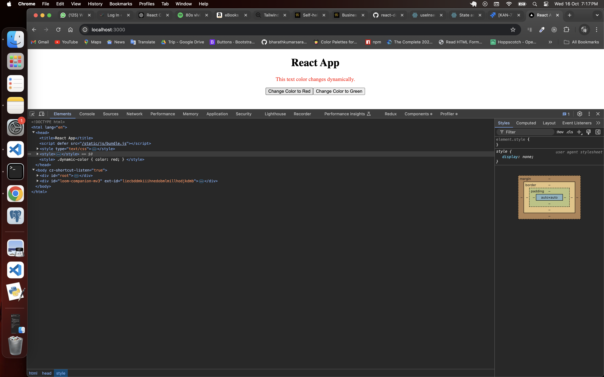

# Experimenting with `useInsertionEffect` in React

useInsertionEffect is a React hook introduced to support libraries that deal with CSS-in-JS or dynamic style injection. It’s used to inject styles into the DOM before the browser paints (render) to avoid layout shifts or flashing during updates.

The useInsertionEffect hook runs synchronously right before mutations are made to the DOM. This ensures that styles or any side effects that need to happen before rendering can occur safely.

[Documentation](https://react.dev/reference/react/useInsertionEffect)

```javascript
import React, { useInsertionEffect, useState } from 'react';

const UseInsertionEffectExample = () => {
  const [color, setColor] = useState('blue');

  useInsertionEffect(() => {
    const styleTag = document.createElement('style');
    styleTag.textContent = `
      .dynamic-color {
        color: ${color};
      }
    `;
    document.head.appendChild(styleTag);

    // Cleanup: remove the style tag when component unmounts or the color changes
    return () => {
      document.head.removeChild(styleTag);
    };
  }, [color]);

  return (
    <div>
      <p className="dynamic-color">This text color changes dynamically.</p>
      <button onClick={() => setColor('red')}>Change Color to Red</button>
      <button onClick={() => setColor('green')}>Change Color to Green</button>
    </div>
  );
};

export default UseInsertionEffectExample;
```
Here the script will be cleared and appended in the head with the new style when everytime the color state updates. 

