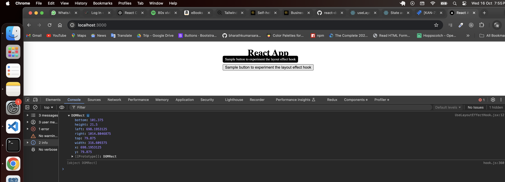

# Experimenting with `useLayoutEffect` in React
useLayoutEffect is a version of useEffect that fires before the browser repaints the screen. Imagine a tooltip that appears next to some element on hover. If there’s enough space, the tooltip should appear above the element, but if it doesn’t fit, it should appear below. In order to render the tooltip at the right final position, you need to know its height.
 
To do this, you need to render in two passes:

    1.Render the tooltip anywhere (even with a wrong position).
    2.Measure its height and decide where to place the tooltip.
    3.Render the tooltip again in the correct place.

All of this needs to happen before the browser repaints the screen. You don’t want the user to see the tooltip moving. Call useLayoutEffect to perform the layout measurements before the browser repaints the screen.

[Documentation](https://react.dev/reference/react/useLayoutEffect)

> Example

```javascript
import React, {useLayoutEffect, useRef} from "react";

const UseLayoutEffectHook = () => {
    const btnRef = useRef(null);
    const [tooltipWidth, setTooltipWidth] = React.useState(0);
    const [show, setShow] = React.useState(false);
    const btnVal = "Sample button to experiment the layout effect hook"

    useLayoutEffect(() => {
        const {top, left} = btnRef.current.getBoundingClientRect();
        setTooltipWidth({top, left});
        console.log(btnRef.current.getBoundingClientRect());
    }, []);

    const toolTipStyle = {
        position: "absolute",
        backgroundColor: "black",
        color: "white",
        padding: "5px 8px",
        borderRadius: "5px",
        display: show ? "block" : "none",
        top: tooltipWidth.top - 30,
        left: tooltipWidth.left,
        fontSize: "12px"
    }

    return (
        <div style={{position: "relative", background: "blue"}}>
            <div style={toolTipStyle}>{btnVal}</div>
            <button ref={btnRef} onMouseEnter={() => setShow(true)} onMouseLeave={() => setShow(false)} >{btnVal}</button>
        </div>
    )


};

export default UseLayoutEffectHook;
```
Here i have get the top and left values of the button and matching same value of the button to tooltip to appear correct. This will be done before browser render the element so nothing will be shifted.



> Doc example

```javascript
import { useRef, useLayoutEffect, useState } from 'react';
import { createPortal } from 'react-dom';
import TooltipContainer from './TooltipContainer.js';

export default function Tooltip({ children, targetRect }) {
  const ref = useRef(null);
  const [tooltipHeight, setTooltipHeight] = useState(0);

  useLayoutEffect(() => {
    const { height } = ref.current.getBoundingClientRect();
    setTooltipHeight(height);
    console.log('Measured tooltip height: ' + height);
  }, []);

  let tooltipX = 0;
  let tooltipY = 0;
  if (targetRect !== null) {
    tooltipX = targetRect.left;
    tooltipY = targetRect.top - tooltipHeight;
    if (tooltipY < 0) {
      // It doesn't fit above, so place below.
      tooltipY = targetRect.bottom;
    }
  }

  return createPortal(
    <TooltipContainer x={tooltipX} y={tooltipY} contentRef={ref}>
      {children}
    </TooltipContainer>,
    document.body
  );
}
```